# My-first-excel-Project-2023-06-30

---

## Intoduction:

This data analysis Project was hosted By CHISOM PROMISE and friends in one data analysis platform on telegram, and we were asked to apply three out of  the six phases of data analysis, which were:to PROCESS, to ANALYSE, and to SHARE insights and recommendations.These insights and recommendations are to help analysts(me inclusive) and businesses stakeholders understand sales and e-commerce territory in southern America, and especially, Brazil, and allow them identify and plan for growth. 
Olist,a Brazilian e-commerce platform that connects small and medium-sized businesses to customers across Brazil. The platform operates as a marketplace, where merchants can list their products and services and customers can browse and purchase them online.
The sales data set is a collection of anonymized data about orders placed on the platform between January 2016 and August 2018. It contains a wide range of information about each order, including the order date, product details, payment and shipping information, customer and seller IDs, and customer reviews. The data set also includes information about the sellers who list their products, as well as data on customer behavior and demographics. The data set is designed to help analysts and researchers better understand the e-commerce landscape in Brazil and identify opportunities for growth and optimization.

## Skills Required:

This project exposed me into the nitty-gritty of EXCEL when:

1.  Processing(Exploration and Data cleaning):
  As I examined the 9 worksheets, I discovered they contained issues such as:

 a. Null and empty columns:To clean them,I replaced them with the correct data using excel “Find and replace” functions.

 b. Irrelevant columns:I validated them completely after taking all the necessary precautions.
 
 c. Duplicates:Erased every duplicate the help of the excel “Filter” function.
 
 d. Data types:were converted using the “Format cells” menu in excel.

 e. Missing values:I used the mean and mode to fill all the necessary columns.
 
**NB**:Before I did cleaned the data,I had to convert a worksheet named “product name category” from a Portuguese language into English for easier understanding.

3.  Analyzing:
For this project I employed the services of maths,aggregate,logical,date and time,text,data transformation functions and formulas are used to perform calculations in order to get insights and recommendation on the data such as:
-SUM, COUNTA, AVERAGE which I used to aggregate and summarize my data.
-ADDITION, SUBTRACTION used to calculations and transformations.
-IF STATEMENTS (=,>,<,>=,>=)  to evaluate logical conditions about the data.
-DATE,MONTH,DAY,YEAR to enable me work on manipulation of date and time columns which needed any form of transformation
-SORT,FILTER,SPLIT helped in reshaping the data to meet certain requirements.

4.  Sharing:
This stage, which involved communicating the insights found into the data set to my audience, I did this with the aid of:
-DASHBOARDS will help my audience understand more about the e-commerce growth in BRAZIL and other southern American countries.
-REPORTS AND SUMMARIES which I’m doing currently to give more context into the dashboard I will share later.
-DOCUMENTATION:I uploaded the README files and dashboard to www.github.com that contains details about the analysis.

## The problems:
1.What is the total revenue generated by company, and how has it changed over time?

2.How many orders were placed on, and how does this vary by month or season?

3.What are the most popular product categories on Olist, and how do their sales volumes compare to each other

4.What is the average order value (AOV), and how does this vary by product category or payment method?

5.How many sellers are active on the platform, and how does this number change over time?

6.What is the distribution of seller ratings on Olist, and how does this impact sales performance?

7.How many customers have made repeat purchases on the e-commerce platform, and what percentage of total sales do they account for?

8.What is the average customer rating for products sold on Olist, and how does this impact sales performance?

9.What is the average order cancellation rate on Olist, and how does this impact seller performance?.

10 What are the top-selling products on the e-commerce platform, and how have their sales trends changed over time?

11.Which payment methods are most commonly used by Olist customers, and how does this vary by product category or geographic region? 

12.How do customer reviews and ratings affect sales and product performance?

13.Which product categories have the highest profit margins on Olist, and how can the company increase profitability across different categories?

14. How does marketing spend and channel mix impact sales and customer acquisition costs, and how can the company optimize its marketing strategy to increase ROI?
    
15. Geo-location having high customer density. Calculate customer retention rate according to geographical locations.

## Resources:
The data sets I used can be found Here. It contains data sets embedded in nine(9)worksheets of an excel workbook,with worksheet names such as:Customers, geographical location, order_items, other_reviews, other_payments, products, sellers, and product names. 

## Data Modelling:
For this project i did not do modelling, and this is because my spreadsheet app is an older version,so i couldnt do the modelling.

## Solutions:
## 1: What is the total revenue generated by company, and how has it changed over time?

### _Total revenue_:
To get the total revenue generated by sellers on the e-commerce platform, I used the excel SUM function to add all the price of product column sellers sold that is in the order_item_data set which amounted to $13,591,643(excluded freight values). 

### _Change in revenue over time_:
To understand the change in REVENUE over time, that is, how revenue has increased or decreased over a particular period, I used the bar chart below to showcase the trend about revenue by “showing the values as a % of the Total revenue”. From that, I discovered that in 2016, revenue was 12.14%, 36.49% in 2017 and 51.37% in 2018. This showed that the company revenue grew in triple folds(exponentially in its 1st year, but could not sustain that in its second year, and only had about 18.17% increase from 2017 to 2018.

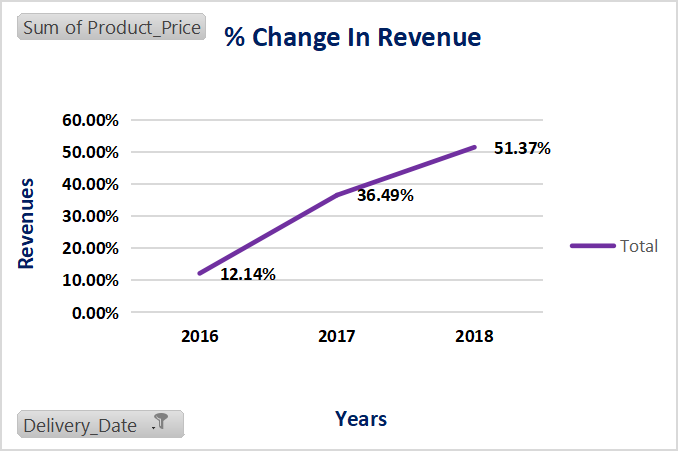

### _Quarterly change in revenue_:
The chart below shows how the platform made their revenue on a quarterly basis, and I arrived at this by inserting date and revenue columns into a bar chart and “grouping” the date in a year and quarter order.
This chart showed a deep in profit in Q1 in year 2017,which was not up to $1M. It was in Q1 and Q2 2018 that the platform made the highest revenue.
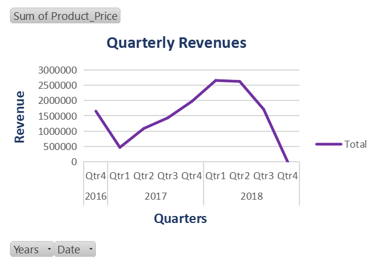

## 2.How many orders were placed on the platform, and how does this vary by month or season?

### _Number of placed orders_:
 To ascertain the total number of orders placed by buyers, I used the COUNTA function to count the the number of non_empty cell in the order_status column of the order_date worksheet. Therefore, the total number of orders placed on the platform by buyers is 99441, considering I included both the approved, canceled, created, delivered, invoiced, processing, shipped, and unavailable orders which were made.

### _Quarterly Order Place_
The chart below indicates that the total number of orders were made quarterly and it sowed a persistent and gradual rise in orders placed on the platform,with its peak in Q1 and Q2, same as in revenue.The orders nosedived in the Q3 and Q4, and which was the end of the data set we were provided with.
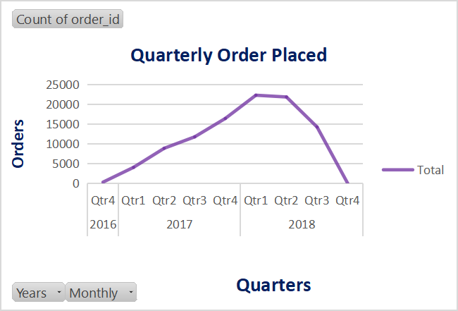

### _Monthly/seasonal variations_:
To arrive at this answer, there will a need for column chart to help showcase how the trends have been over a quarterly, monthly or seasonally period. Looking at this chart, it shows august as the months with the highest number of orders being placed, followed by march. On the other end is September and November, with both of being the least month with order being placed due to the same reason given above.
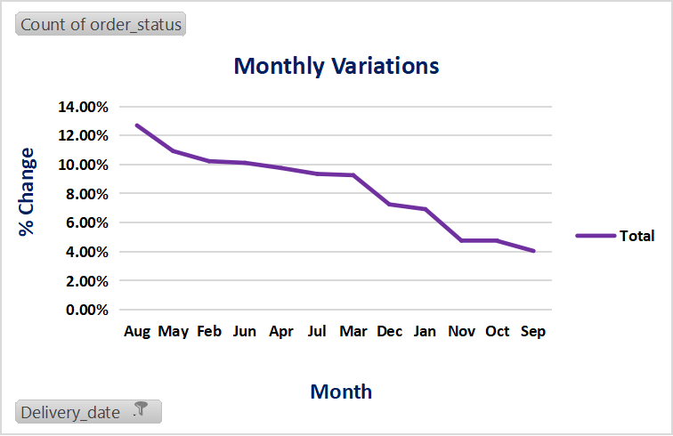

## 3. What are the most popular product categories on the platform, and how do their sales volumes compare to each other?
### _Most popular product_: 
To know the most popular product in the list of products offered on their e-commerce platform, I inserted the “product_category_name” and the order ID columns from the product and order data set that contains information about quantities of products bought by customers, and the aid of the Bar chart below, I was able to arrive at the insight needed. And the most popular of them all(highest product purchased) is: the “cama_mesa_banho”, translated as “bed_bath_table”,with an AOV  of $15. 

**NB**:_I only filtered the top 10 of them because the question was asked was about knowing the most popular product offered by the entity_.
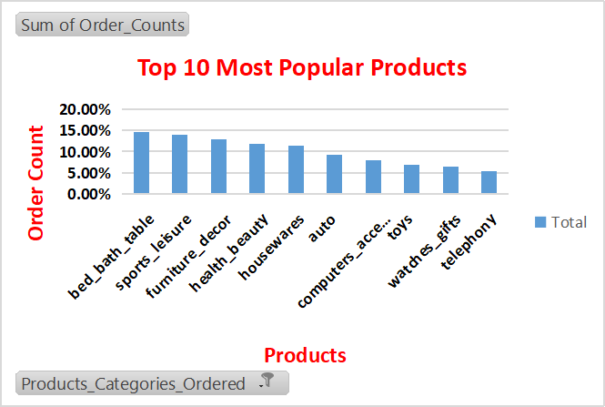

## 4: What is the average order value (AOV), and how does this vary by product category or payment method?

### _AVG order value_:
To answer this particular question, I divide the total revenue by Total number of orders made by customers on the platform, that is,$13,591,643.70/99441, and it amounted to 136 dollars and 68 cents as per overall average orders made on the platform.

### AOV by products:
On the other hand, I also used two bar charts below to represent the average order for every product purchased on the platform. Those charts displays that the house_ware sells for $809(most expensive)on an average and the bed_bath_table,the cheapest,sells for as low as $15,averagely.This signifies that the most expensive product does not equal the most popular.                         NB:To make easier to understand, I had to show only the the top and bottom 10 of all the over 70 products on the e-commerce platform, in other not overcrowd the charts.

 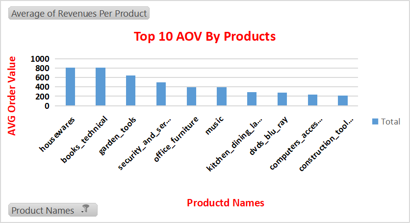
 ---
 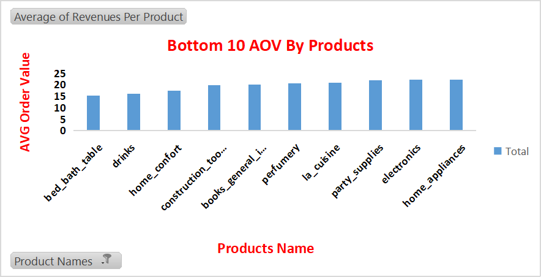
 ---

### _AOV vs Products variations_:
I simply made of bar chart below, and in it I dragged the product category name column into the row field of the pivot table and also dragged the product price into the value field, and then changed its value field settings to “average”, to give the average value order per product.
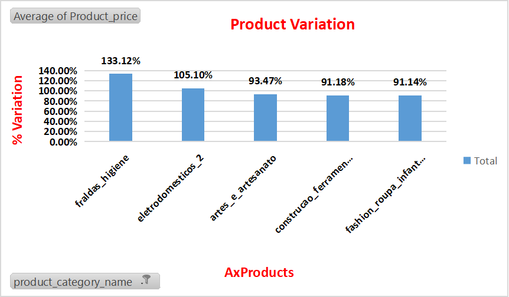

## 5.How many sellers are active on the platform, and how does this number change over time?

### _Number of active sellers_:
To determine the number of sellers on the e-commerce platform, I used the COUNTA function to count the total number of seller_ID in the sellers_data_set, and they were numbering a total of 3095 sellers on the platform.

### _Active sellers Change over time_:
_NB:Since the data set capture sales in two years,I decided visualize the seller into the first one year and then the overall period when the platform did business,and these were my results_: 

### _One year Seller’s Variation_:
As observed  in this chart below,in 2016, the month with the topmost no of seller was in December,which had 282 sellers,with November being the lowest(1 Seller).After the commencement of biz in 2017,February encountered the highest number of sellers, with July being the month with the lowest under the period in review.They had 4 and 130 sellers respectively.
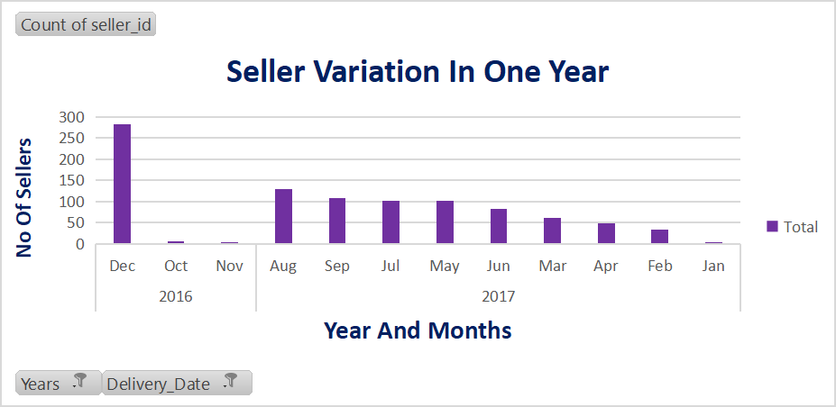

### _Overall Seller’s Variation_:
The chart below indicate that the month with highest no of active sellers was in December 2016(282 sellers) with November 2017(only 1 seller) being the lowest.The platform also experienced a boom in active sellers in February of 2019(264 sellers).
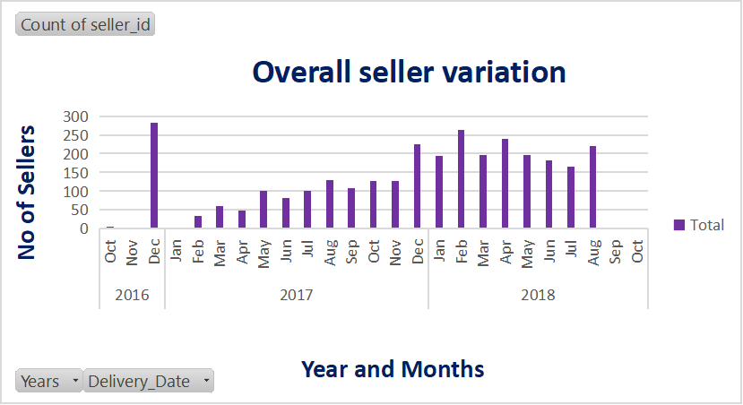

## 6: What is the distribution of seller ratings, and how does this impact sales performance?

### _Sellers distribution_: 
The pie chart below showed there were 1824 “excellent” ratings out of a possible 3095 sellers.There were 343 “bad” feedback from clients about sellers on the platform,which is lowest among the ratings.
This is a good development for the platform,and their aim is to use better customer service to reduce the negative feedback from buyers.
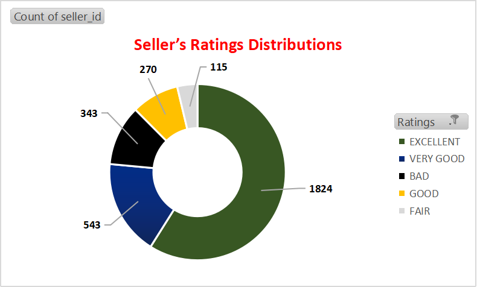

### _Sellers ratings vs sales performance_:
The pie chart below shows the changes that occurred when product price and customer’s ratings are paired,and it indicates sellers that sales expensive items are rated low and those sales cheaper ones are rated high.
The reason for this might simply be because customers don’t usually get values for their money when they buy those expensive products,or just simply because there is no enough economic power to do that.
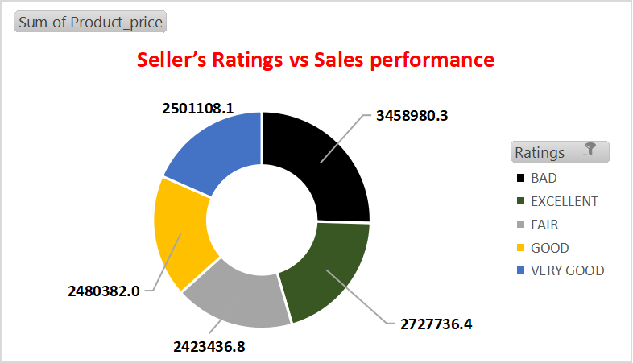

##7.How many customers have made repeat purchases on the e-commerce platform, and what percentage of total sales do they account for?

### _Repeat customers_:
The bar chart below indicates the most frequent/repeat customer to the platform is the customer with this ID:8272b63d03f5f79c56e9e4120aec44ef. They made a total of 21 visits to the platform,which is the highest/most frequent.
To strengthen their relationship,the platform should introduce customer loyalty product and discount for frequent visitor to encourage more people.

## 8: What is the average customer rating for products sold, and how does this impact sales performance? 

### _Avg customer ratings_:
The AVG customer rating for products indicates that out of the 71 available products on the platform,41(64.7%)received “Excellent” ratings,with 8(11.2%)of the ratings being “Bad”. Going by this,that reviews ratings should be improved on through customer relationship strategies.

### _Customer ratings vs sales performance_:
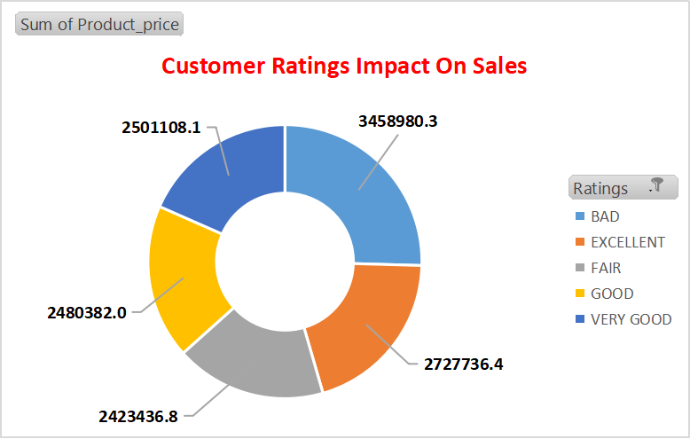

## 9.What is the average order cancellation rate on platform, and how does this impact seller performance?

### _Avg order cancellation_:
With the help of excel COUNTIF function, I was able to count the number of canceled order on the platform, and I used the result to divide the total number of order made, and then multiplied it by 100. It gives you 0.64, and this shows the number of canceled orders are very small and it is great,and that they are able to sell almost every order made at their store. For any platform,this is a great indicator,because it means for every 10 customer that made an other 9.994 are buying.

## 10.What are the top-selling products on the e-commerce platform, and how have their sales trends changed over time?

### _Top selling products_:
The overall top-selling products are health beauty,automobiles and computer accessories,which were sold 895 times apiece on the platform. For 2017,the health beauty was the highest selling product,while computer accessories and automobiles were the highest order placed on the olist platform.
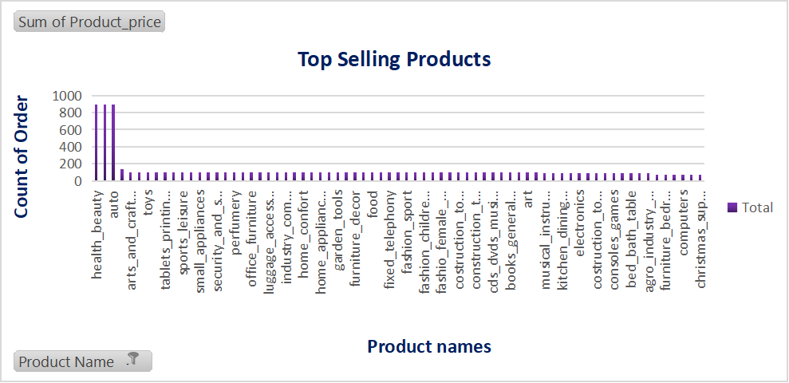

## 11.Which payment methods are most commonly used by customers, and how does this vary by product category or geographic region?

### _Payment methods_:
The most frequently used method of payment on the platform is CREDIT CARD with 76795 transactions and that is simply because, the world is now global and therefore people now search for convenience when they shop, and this method signifies CONVENIENCY and SMOOTHLY transaction. The credit card is followed by bank slip(beloto)with 19784 transactions.
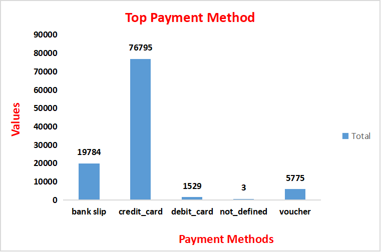

### _Payment method by products_:
A look at the chart below shows that the agro_industry_and_commerce had the highest % of credit card transactions with 5.16% of the total transactions were done through it. While with the bank slip/boleto payment method,the art category had the highest volume of transactions with 2.62%,and the bed_bath_tables section were bought with debit cards(1.58%).
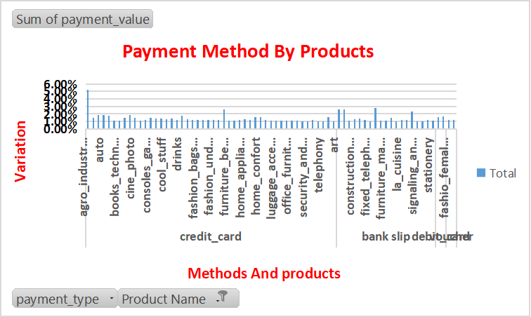

### _Payment method by geolocation_:
When I paired both the payment methods with geographical location on the bar chart,it showed that sau paulo was the largest location that used both the credit cards,bank slip and debit card with 73.92%,19.04%,5.56%,1.47% of the total transactions,respectively. 
What this says about the platform is that most of her customers are still located in one direction. So,stakeholders should improve promotion and advertisement strategy to be able to capture other geo locations.
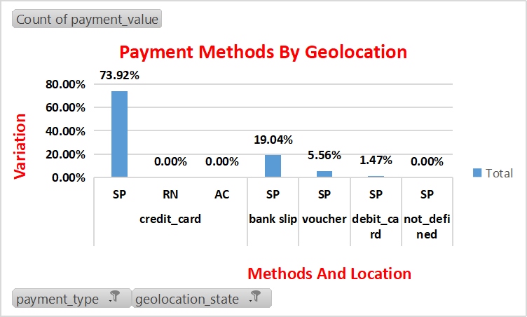

## 12.How do customer reviews and ratings affect sales and product performance?

### _Customer ratings vs sales_:This question is similar to the B part of question 6.
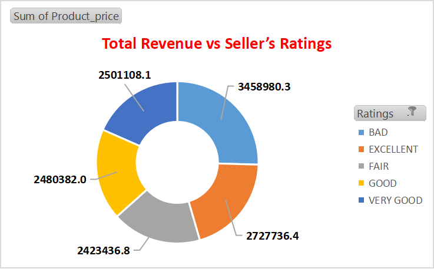

## 13.Which product categories have the highest profit margins on the platform, and how can the company increase profitability across different categories?

### _Highest profit_:
The product with the highest profit margin according the chart below is the house ware category with AVG profit of $809 per product.coincidentally,its not the most sought after item on the platform which maybe as a result of them being luxury/specialty products,which are usually expensive with high margin,unlike consumer products.  
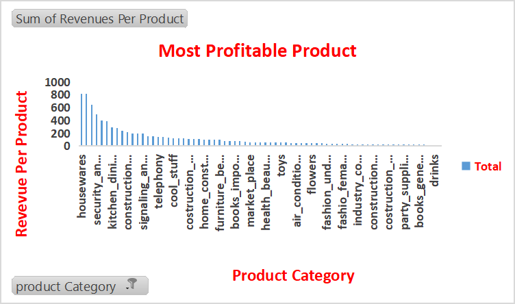

## _To Increase Profitability Across Different Product Categories,stakeholders should_:
i._Reduce Expenses_
ii._Introduce New Products_
iii._Improve Marketing Efforts_
iv._Identify New Market For existing Products_

## 14.How does marketing spend and channel mix impact sales and customer acquisition costs, and how can the company optimize its marketing strategy to increase ROI?

### _They impact sales and customer acquisition cost through_:
i._Analyzing data on how different marketing channels perform_
ii._Analyzing the impact of marketing spend through customer acquisition cost_
iii._Analyzing the efficiency of different channels_
iv._Considering implementing data-driven marketing strategy_
v._Regularly analyzing and adjusting its marketing strategy based on data-driven insights_

### _They can optimize their marketing strategy by_:

## 15.Geo-location having high customer density. Calculate customer retention rate according to geographical locations?

### _Highest density location_:
Looking at the chart below,the most populated located(State) where customers that placed orders on the platform comes from is BAHIA state with 35980(36.14%) out of the 99441 orders.
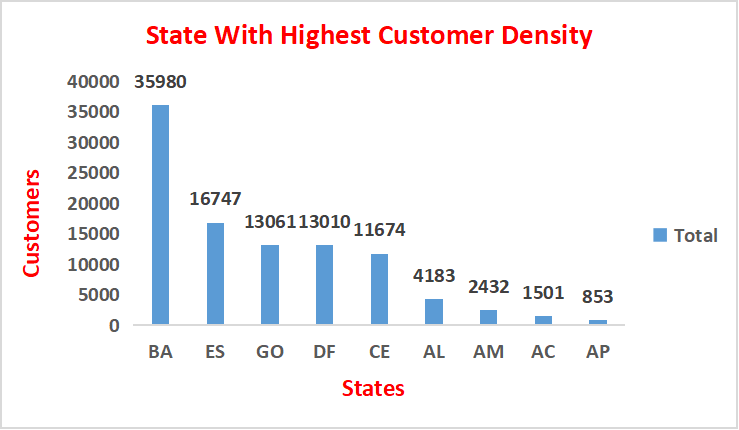

### _Retention rate_:
The retention rates for Acre(AC) and Rondonia(RO)stands at 10.2% and 10.5 respectively.So therefore they are the two top states followed by by Rio de Janeiro(RJ)with 6.8% retention rate.

## Data Visualization:
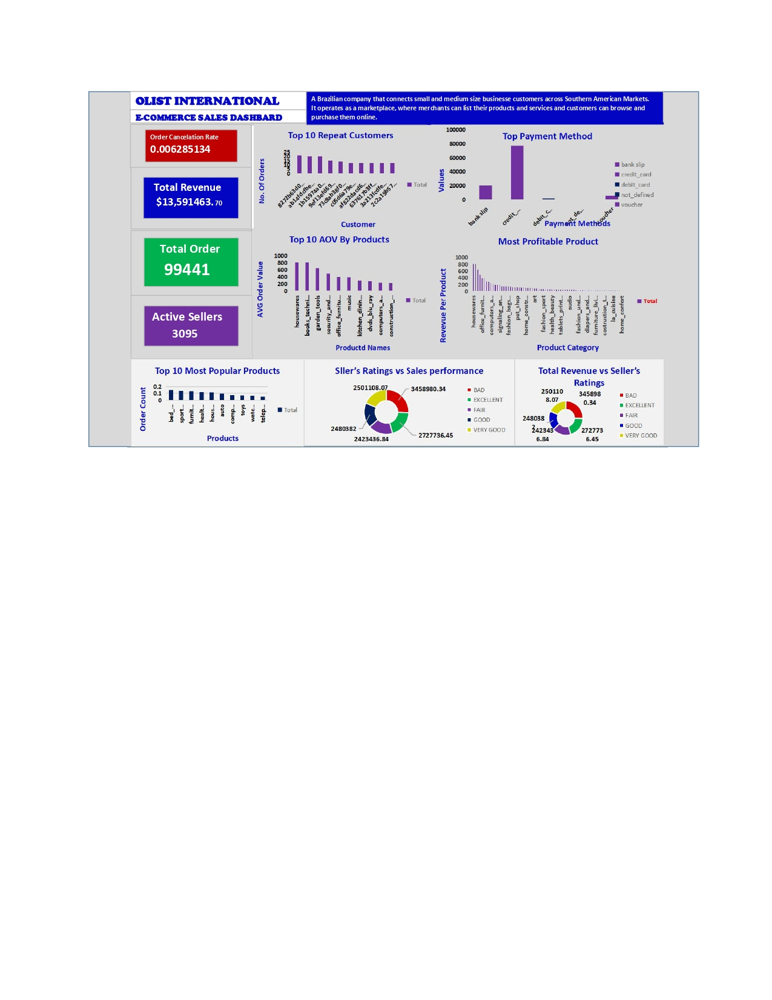
---

## Key findings:
1. For the 2 years under review,the platform generated $13,591,643in revenue with the 3rd year having the most revenue for the platform,which signified that as they grew,more sellers and customer kept increasing.
2. Out of 99441 orders placed on the platform,1st and 2nd quarter of 2018 had the most with 22% and 21% respectively of the overall revenue.This also backs the notion that 2018 had the most revenue for the platform.
3. Over the 24 months period that the data set lasted,august had more orders placed in them with 12.69%of total orders, and September being the lowest(4.04%).
4. The most popular product category on offer on the platform is bed_bath_table with an average price of $15. Incidentally,it is not the expensive category.
5. The house_ware category is the most expensive items on the platform with average price of $809 per product.
6. There are 3095 active customers on the platform and this number started with 6 of them in Oct 2016.
7. There were “Excellent” feedback from customers about the products from 
8. Sellers that sale expensive/luxury products,you are rated low and vice versa,as a seller on the platform.
9. Overall,products on the platform got more “excellent” review ratings from customers who used them,which might as a reason their durability,efficiency,price,and the overall distribution process.
10. The order cancellation rate is 0.64%,which indicates that more customers are buying as they order. This may be a reason for the finding above.
11. The most ordered products were the health beauty, computer accessories and auto category,these were bought 895 times apiece.
12 Credit card is the most used payment method due to its efficiency.They were used in 76795 out of the 99442 transactions carried out on olist.
The house ware category had the highest average profit of $809.
The most populated location for customer on olist is BAHIA 35980(36.14%)people buying from the platform.

## Recommendation:
1. Going forward,the platform has to would need to get involved with cross-selling and upselling,tiered pricing to promote the sales of products with high AOV in order to boost profitability.
2. Even though the platform has the best cancellation rate,it needs to work on its customer-facing part of management,and also introduce(if not available )discounts and other promotion techniques to encourage retention.
3. The should introduce discount for people who buy in large quantity for low-rated products and the ones low-margin to increase profitability.Application of dynamic pricing technique is encouraged too.
4. They should keep in touch with old customer,improve user experience(UX) and make the purchasing process easier to increase retention in location were they are low.
5. The platform should increase different varieties of products sold to help bring in more customer.

References:
Chat.openai.com

www.medium.com

www.quora.com

www.youtube.com

www.kaggle.com

www.github.com

### _Finally!!!Thanks for staying till the end
### _Please, leave feedback and recommendations to enable me improve.
## _Mucha gracias_

